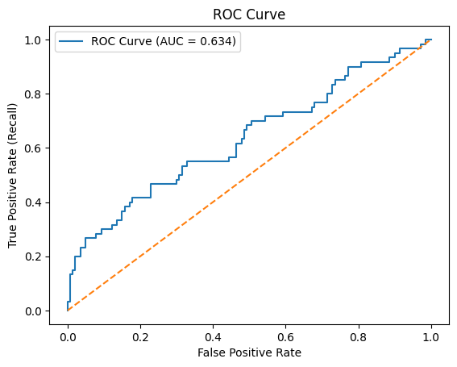
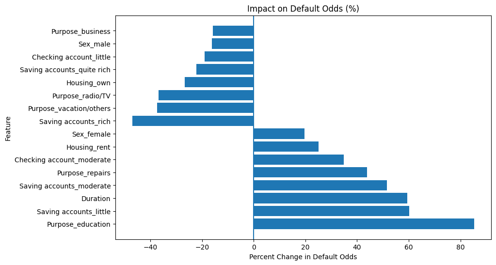

# Credit Risk Modeling — Loan Default Prediction

## Executive Summary
This project develops an interpretable machine learning model to estimate borrower default risk using financial and demographic characteristics.

The objective is to replicate how banks and lending institutions evaluate credit applications, quantify default probability, and identify the primary drivers of lending risk.

A logistic regression framework was selected to prioritize **model interpretability**, aligning with real-world regulatory and risk-management requirements in banking.

---

## Dataset
**German Credit Dataset (UCI / Kaggle)**

- 1,000 loan applicants
- Financial, behavioral, and demographic variables
- Binary outcome: **Good vs Bad Credit Risk**

---

## Modeling Approach

### Data Preparation
- Removed non-informative identifiers
- Handled missing account information
- One-hot encoded categorical variables
- Standardized numerical features

### Model
- Logistic Regression (baseline credit scoring model)
- Train/Test Split (80/20)
- Pipeline-based preprocessing to prevent data leakage

### Evaluation
- ROC Curve & AUC analysis
- Confusion Matrix evaluation
- Decision threshold optimization using **Youden’s J Statistic**
- Odds ratio interpretation for business explainability

---

## Model Performance
- **ROC–AUC:** 0.63  
- Optimized probability threshold improved detection of high-risk borrowers while maintaining approval balance.

This reflects realistic performance for small-tabular credit datasets and demonstrates trade-offs between approval rate and default risk.

---

## Key Risk Drivers

### Factors Increasing Default Risk
| Variable | Impact on Default Odds |
|-----------|----------------|
| Education Loans | +85% |
| Low Savings Balance | +60% |
| Longer Loan Duration | +59% |
| Rental Housing | +25% |

### Factors Reducing Default Risk
| Variable | Impact on Default Odds |
|-----------|----------------|
| High Savings Balance | −47% |
| Home Ownership | −27% |
| Consumer Purchase Loans | −36% |

These results illustrate how borrower liquidity and loan purpose materially influence repayment risk.

---

## Visualizations

### ROC Curve

### Model Risk Drivers (Odds Ratios)

---

## Business Interpretation
This model demonstrates a simplified **credit scoring workflow** used in retail banking:

- Estimate probability of borrower default
- Adjust approval thresholds based on risk tolerance
- Identify financially meaningful risk indicators
- Support explainable lending decisions

---

## Tools & Technologies
Python • Pandas • NumPy • Scikit-Learn • Matplotlib • VS Code • Git/GitHub

---

## Repository Structure
credit-risk-model/
│
├── notebooks/
│   └── credit_risk_model.ipynb
├── images/
│   ├── roc_curve.png
│   └── risk_drivers_odds.png
└── README.md

---

## Author
**Alexis Trebeau**  
University of North Carolina at Chapel Hill  
Statistics & Data Science | Business Minor  
Aspiring Risk / Financial Data Analyst